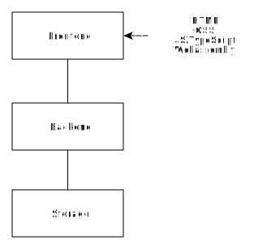
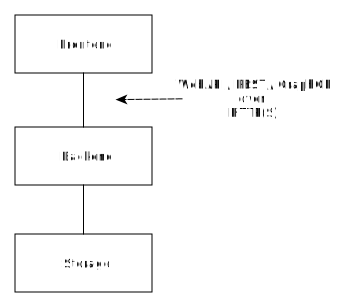
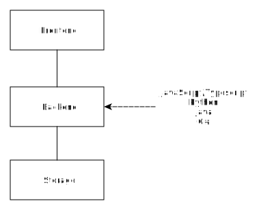
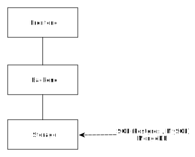
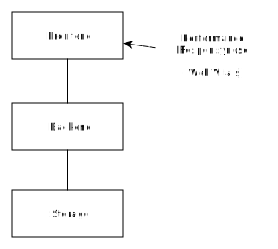
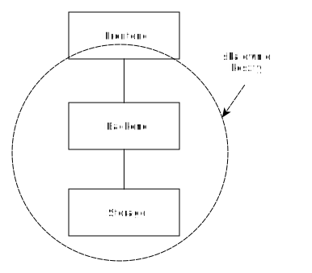
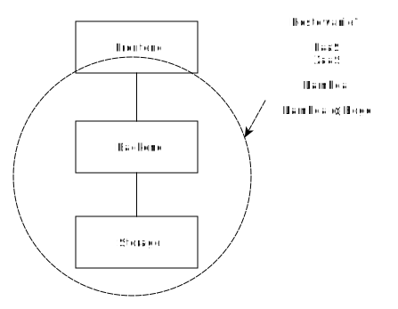

<!-- _class: lead -->
# Programowanie Aplikacji Internetowych

---
<!-- _class: lead -->
## Wykładowca
 

- Wojciech Barczynski
- wojciech.barczynski@wsb.wroclaw.pl

---
<!-- _class: lead -->
## Zaliczenie
 

- Egzamin + Obecność

---
<!-- _class: lead -->
## Materiały
 

- github,
- utworzę również grupę na MS Teams.

---
<!-- _class: lead -->
### Wprowadzenie

---
<!-- _class: lead -->
### Wprowadzenie

---
<!-- _class: lead -->
### Wprowadzenie

---
<!-- _class: lead -->
### Wprowadzenie

---
<!-- _class: lead -->
### Wprowadzenie

---
<!-- _class: lead -->
### Wprowadzenie

---
<!-- _class: lead -->
### Wprowadzenie

---
<!-- _class: lead -->
## Jak zacząć 1

Frontend:

- [vue.js](https://vuejs.org) or [React](https://react.dev)

---
<!-- _class: lead -->
## Jak zacząć 1

Backend:

- PHP + Laravel [1](https://kinsta.com/blog/php-frameworks/#laravel)
- Python + Django, Flask or FastAPI
- Typescript or Javascript - NodeJS

---
<!-- _class: lead -->
## Jak zacząć 2

Frontend / Backend TypeScript:

- [Next.js](https://nextjs.org/)
- TypeScript
- [Tailwind](https://tailwindcss.com/) - style
- [Prisma](https://www.prisma.io/) do baz danych

---
<!-- _class: lead -->
## Jak zacząć

Praca własna:

0. 2x tutorial z danej technologii,
1. Zbudowanie prostej aplikacji,
2. Szukamy pomysłu co można do aplikacji dodać,
3. Rozwijamy w cyklu 1 tygodniowym,
4. Warto się pochwalić,
5. Wracamy do 2.

---
<!-- _class: lead -->
## Jak zacząć

Tutoriale & trzeba dojść do końca, żeby zrozumieć niektóre kroki.

---
<!-- _class: lead -->
## Jak zacząć

Taktyka:

- w iteracjach
- traced-bullet approach (deliver, patch, patch)
- wrzucamy do gita
- korzystamy z lintera

---
<!-- _class: lead -->
## Jak zacząć

Później:

- testy
- Continuous Integration and Delivery ([tutorial](https://github.com/wojciech11/se_continuous_delivery_and_deployment))
- np., github workflow

---
<!-- _class: lead -->
## Przyśpieszenie nauki

Aka, programowania można nauczyć się tylko na własną rękę:

- najlepiej w dwójkę (może macie już partnera do nauki i [wzajemnego coachingu](https://www.edbatista.com/the-art-of-self-coaching-public-course.html)),
- najlepiej jako pair programming,
- zrobienie jednego tutoriala lub dwóch dla technologii wspomnianej na wykładzie,
- wrzucenie na githuba.

---
<!-- _class: lead -->
## Tips

- [revealjs](https://revealjs.com/).

---
<!-- _class: lead -->
## Misc

What craftswoman do you follow?

- Martin Thomson - [performance](https://www.youtube.com/watch?v=S4LzzuMTqjs)
- Peter Bourgon - [Golang](https://peter.bourgon.org/go-in-production/)
- Robert C. Martin - [arch](https://www.youtube.com/watch?v=WpkDN78P884), [scrum](https://www.youtube.com/watch?v=hG4LH6P8Syk), [craftsman](https://www.youtube.com/watch?v=p0O1VVqRSK0&list=PLRTidqHTMvtn9Zm0T8fbonHKuueKWc_r7)
- JS/TypeScript: ?
- ML/AI - people around fastai.

---
<!-- _class: lead -->
## Dziękuję za uwagę
 
