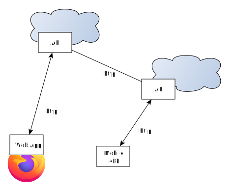
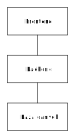

<!-- _class: lead -->
# Programowanie Aplikacji Internetowych

API / Komunikacja między serwisami

---
<!-- _class: lead -->
## Plan na dziś
<br />

- http
- RPC
- REST
- GraphQL

---
<!-- _class: lead -->
## HTTP


---
<!-- _class: lead -->
## HTTP

Cała infrastruktura przystosowana do pracy z http:


---
<!-- _class: lead -->
## HTTP

Demo:

```bash

curl -I www.google.com

curl -I -L google.com
```

---
<!-- _class: lead -->
## HTTP - methods

[Methods](https://developer.mozilla.org/en-US/docs/Web/HTTP/Methods):

- GET
- POST
- PUT
- DELETE

---
<!-- _class: lead -->
## HTTP - status code

[Status code](https://developer.mozilla.org/en-US/docs/Web/HTTP/Status):

- 5xx: 500, 502
- 4xx: 404, 400, 401
- 3xx: 301, 302
- 2xx: 200, 201, 02

Warto wiedzieć, gdzie jest błąd.

---
<!-- _class: lead -->
## WebSockets

- dwustronnej szybkiej komunikacji
- Alternatywa dla *long polling*

Więcej później o [websocketach i socketio](https://ably.com/topic/socketio-vs-websocket) później.

---
<!-- _class: lead -->
## A co z serwisami?

- +/- Wiemy jak działają przeglądarki
- co z serwisami?

---
<!-- _class: lead -->
## A co z serwisami?



---
<!-- _class: lead -->
## Protokoły

Najpopularniejsze:

- (web) RPC
- REST API
- GraphQL

---
<!-- _class: lead -->
## (web) RPC

- RPC (remote procedure call)
- po prostu wywołanie zewnętrznej funkcji

---
<!-- _class: lead -->
## (web) RPC

Przykłady / o czym należy pamiętać wywołując zewnętrzny serwis:

- [example_py_call_rest_api](example_py_call_rest_api/)
- [example_js_call_rest_api](example_js_call_rest_api/)
- [example_js_call_rest_api](example_ts_call_rest_api/)

---
<!-- _class: lead -->
## REST API

- Inspiracja: jak działa komunikacja między przegląrką, a serwerem,
- Istniejąca infrastruktura,
- Najbardziej popularne podejście.

---
<!-- _class: lead -->
## Przykład - Github

Przyjrzyjmy się bliżej API:

- [commits](https://docs.github.com/en/rest/commits/commits);
- [prs](https://docs.github.com/en/rest/pulls/pulls#list-pull-requests);
- [authentication](https://docs.github.com/en/rest/overview/authenticating-to-the-rest-api).

---
<!-- _class: lead -->
## Przykład - Github

Co warto sprawdzić:

- [verbs](https://docs.github.com/en/rest/overview/resources-in-the-rest-api#http-verbs);
- [errors](https://docs.github.com/en/rest/overview/resources-in-the-rest-api#client-errors);
- [rate limiting](https://docs.github.com/en/rest/overview/resources-in-the-rest-api#rate-limiting).

---
<!-- _class: lead -->
## Przykład - Github

Często mamy już dostępne biblioteki:

- oficjalne - [github.com/octokit](https://github.com/octokit)
- nieoficjalne - [google/go-github](https://github.com/google/go-github)

---
<!-- _class: lead -->
## Jeśli budujesz API

Warto się wzorować na:

- shopify API - [przykład](https://shopify.dev/docs/api),
- twillio - https://www.twilio.com/docs/usage/api,
- ably - https://ably.com/docs/api/rest-api#publish,
- + pragmatyzm;
- + [dobre praktyki](https://cloud.google.com/blog/products/api-management/restful-web-api-design-best-practices).

---
<!-- _class: lead -->
## REST API

Zasady:

- Logical organization of resources
- Logical nesting
- Stateless
- cacheable data
- większości JSON-based

---
<!-- _class: lead -->
## REST API

Projekty / standardy:

- [OpenAPI](https://www.openapis.org/) - industrial standard;
- [json API](https://jsonapi.org/) - popularniejsze z bardziej ustrukturyzowanego podejścia.

---
<!-- _class: lead -->
## REST API

Wiele godzin rozstało przepalone na dyskusjach co to jest REST API i czy dane API jest rzeczywiście REST...

---
<!-- _class: lead -->
## Ograniczenia REST API

- [wszystko albo nic](https://docs.github.com/en/rest/pulls/pulls?apiVersion=2022-11-28#list-pull-requests);
- kilka(naście) requestów, żeby zebrać dane;
- a potem składanie.

---
<!-- _class: lead -->
## Ograniczenia REST API

- za każdym razem backend musi pisać API dla frontendu (backed-for-frontend);
- czasami gonienie za nieuchwytnym celem.

---
<!-- _class: lead -->
## Plusy REST API

- Cacheable;
- łatwe do zrozumienia;
- z OpenAPI, duża ilość narzędzi out-of-the-box, np., [browsable API](https://www.django-rest-framework.org/topics/browsable-api/);
- bez niespodzianek dla backendu.

---
<!-- _class: lead -->


---
<!-- _class: lead -->
## GraphQL

- https://graphql.org/
- https://graphql.org/learn/

---
<!-- _class: lead -->
## Narzędzia

- [insomnia](https://insomnia.rest/) lub [postman](https://www.postman.com/)
- [curl](https://curl.se/)
- [jq](https://stedolan.github.io/jq/)
- biblioteki [jmespath](https://jmespath.org/)

---
<!-- _class: lead -->
## Warto wiedzieć

- gRPC
- [OData](https://www.odata.org/) - less popular

---
<!-- _class: lead -->
# Architektura



---
<!-- _class: lead -->
# Zauważ

- JS/TS w przeglądarce to też aplikacja,
- Docelowo - JS/TS powinna komunikować się przez API.

---
<!-- _class: lead -->
## Dziękuję za uwagę
<br />

---
<!-- _class: lead -->
# Backup slides
<!-- https://wttr.in/ -->

---
<!-- _class: lead -->
## 3-tier architecture


---
<!-- _class: lead -->
## Jak hostować?

- PaaS: [vercel](https://vercel.com/), [netify](https://www.netlify.com/), [heroku](https://www.heroku.com/);
- CaaS (AWS EKS, GCP) - container-as-a-service
- XaaS (AWS, GCP):

  - IaaS
