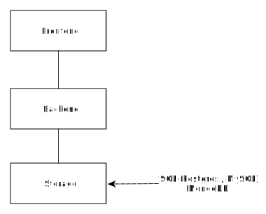

<!-- _class: lead -->
#### Programowanie App Internetowych


Bazy danych

---
<!-- _class: lead -->
## Bazy danych




---
<!-- _class: lead -->
## Na dziś:

- bazy danych - co mamy do wyboru?
- plain SQL vs ORM
- SQL DB + express.io
- primsa

---
<!-- _class: lead -->
## Bazy danych

- SQL: PSQL && MySQL,
- noSQLs: Amazon DynamoDB, mongodb,
- cache: od edge i web cache po redis/memcache po stronie backendu.

---
<!-- _class: lead -->
## Nie zapomnijmy o

- Object storage, np.: Amazon S3 czy Google Storage
- kolejki:

  - Amazon SQS, RabbitMQ, Kafka

- Backend-as-a-Serive, np., Google Firebase

---
<!-- _class: lead -->
## SQL


---
<!-- _class: lead -->
## SQL

Nie będziemy omawiać:
- [CAP](https://en.wikipedia.org/wiki/CAP_theorem)/[PACELC](https://en.wikipedia.org/wiki/PACELC_theorem)
- [Modele spójności](https://aphyr.com/posts/313-strong-consistency-models) i ACID
- Eventual consistency


---
<!-- _class: lead -->
## Którą bazę danych?

Pragmatycznie:

1. SQL - zgodny z [Postgres](https://www.postgresql.org/) lub [MySQL](https://www.mysql.com/) API;
2. Hostowany przez cloud providers (aka życie za krótkie jest, aby zarządzać bazą danych i backupem);
3. Nie szedłbym w NoSQL czy grafowe, jeśli nie ma bardzo mocnych przesłanek.

---
<!-- _class: lead -->
## Którą bazę danych?

Side note - ważna decyzja techniczna

1. Napisz design doc,
2. Warto dodać sekcję pre-mortem.

---
<!-- _class: lead -->
## Którą bazę danych?

New global scale DBs:

- [cockroach DB](https://www.cockroachlabs.com/)
- Yugabyte

Fascynująca dziedzina w inżynierii!


---
<!-- _class: lead -->
## Baza danych vs App

1. Plain SQL
2. Lightweigh DSL over SQL (**tutaj zacznij**)
3. ORM


Zobacz też: [logrocke blog](https://blog.logrocket.com/node-js-orms-why-shouldnt-use/).


---
<!-- _class: lead -->
## Plain SQL with Database driver

```js
const mysql = require('mysql')
const connection = mysql.createConnection({
  host: 'localhost',
  user: 'dbuser',
  password: 's3kreee7',
  database: 'my_db'
})

connection.connect()

connection.query('SELECT 1 + 1 AS solution', (err, rows, fields) => {
  if (err) throw err

  console.log('The solution is: ', rows[0].solution)
})

connection.end()
```

## Lightweigh DSL

Query Builder - [knex](https://github.com/knex/knex):

```js
const pg = require('knex')({client: 'pg'});

knex('table')
  .insert({a: 'b'})
  .returning('*')
  .toString();
```

---
<!-- _class: lead -->
## ORM

Na plus:

- Avoid redundant code
- Easily switch from one database to another
- Query for multiple tables (ORM converts the object-oriented query approach to SQL)
- Focus more on business logic and less on writing interfaces

---
<!-- _class: lead -->
## ORM

Praktyka:

- niska wydajność,
- daje fałszywe poczucie, że nie trzeba myśleć o bazie danych
- dużo magi, trudne w debugingu

---
<!-- _class: lead -->
## Rekomendacja

- Unikaj ORMów
- Query buildery lub lekkie ORMy OK
- Zacznij od query builderów, np., [knex](https://github.com/knex/knex).

---
<!-- _class: lead -->
# Let's get the hands dirty

---
<!-- _class: lead -->
# MySQL + Expressjs
