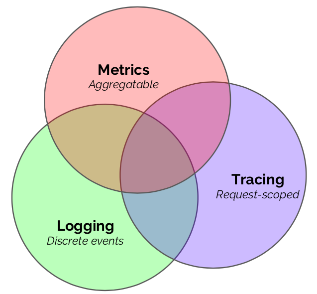
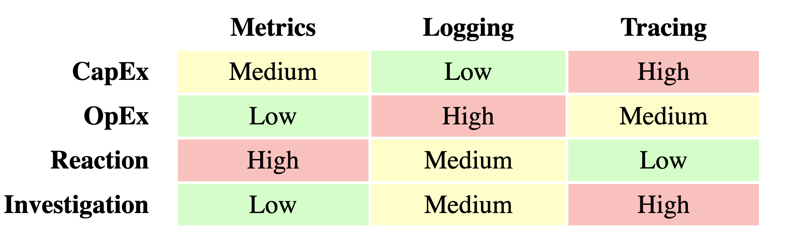
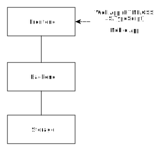
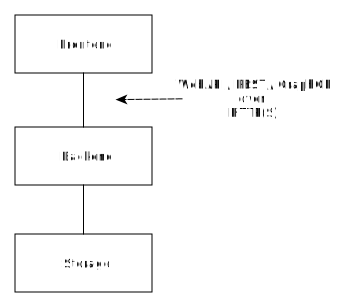
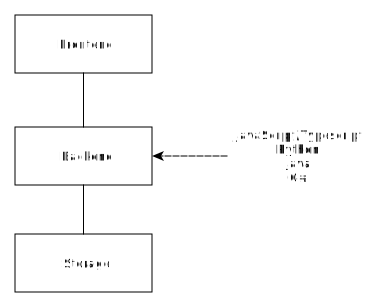
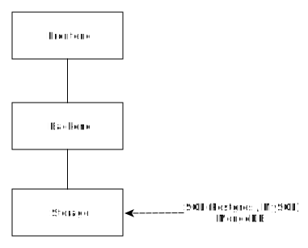
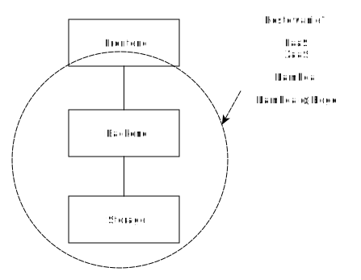

<!-- _class: lead -->
# Produkcja

---
<!-- _class: lead -->
### Dzisiaj

1. 12factor apps
2. Continuous Integration && Deployment
3. Observability
4. Performance testing and monitoring

---
<!-- _class: lead -->
### 12factor apps

Dobre praktyki dla pisania aplikacji SaaS:

- [12factor.net](https://12factor.net/)

---
<!-- _class: lead -->
### CI/CD

- Continuous Integration
- Continuous Deployment

---
<!-- _class: lead -->
### Continuous Deployment

Dlaczego?

---
<!-- _class: lead -->
### High Performance Teams

DORA metrics:

- deployment freq
- lead time
- failure rate
- MTTR

---
<!-- _class: lead -->
### Continuous ____

- [Przykład 1](https://github.com/wojciech11/se_continuous_delivery_and_deployment/tree/master/01_cwiczenia)
- [Przykład 2](https://github.com/wojciech11/se_continuous_delivery_and_deployment/tree/master/02_cwiczenia)

---
<!-- _class: lead -->
### Continuous Deployment

1. W każdym projekcie, niezawodny Continuous Deployment powinno być priorytetem!

2. Wszystko idzie przez repozytorium Gita.

---
<!-- _class: lead -->
## Observability

---
<!-- _class: lead -->
### Observability

(Classic) types:

- logging
- monitoring
- tracing

---
<!-- _class: lead -->

<small><a href="https://peter.bourgon.org/go-for-industrial-programming/#observability">źródło</a></small>

---
<!-- _class: lead -->
### Observability

<small><a href="https://peter.bourgon.org/go-for-industrial-programming/#observability">źródło</a></small>

---
<!-- _class: lead -->
### Monitoring: alerts

Alerts on metrics measuring user's experience (see <a target="_blank" href="https://prometheus.io/docs/practices/alerting/">docs</a>)

---
<!-- _class: lead -->
### Observability

Więcej na:

- [Budowa i Administracja aplikacji w chmurze](https://github.com/wojciech11/se_cloud_app_administration_and_development/tree/master);
- [Instrumentyzacja aplikacji i monitoring z Prometheusem](https://github.com/wojciech12/talk_monitoring_with_prometheus).

---
<!-- _class: lead -->
### Rekomendacja

<ul>
  <li>Start with monitoring;</li>
  <li>Metrics? Start with <a href="https://www.statuscake.com" style="color:black">Up/Down</a>, than RED and USE;</li>
  <li>Drop-in solution Prometheus;</li>
  <li>Retrospektywy</li>
</ul>

---
<!-- _class: lead -->
## Performance monitoring & testing

---
<!-- _class: lead -->
### Dlaczego wydajność jest ważna

Ecommerce ([cloudflare](https://www.cloudflare.com/en-gb/learning/performance/more/website-performance-conversion-rates/)):

<!-- https://www.cloudflare.com/en-gb/learning/performance/why-site-speed-matters/ -->

---
<!-- _class: lead -->
### Dlaczego wydajność jest ważna

Bounce rate: ([cloudflare](https://www.cloudflare.com/en-gb/learning/performance/why-site-speed-matters/)):

`BBC discovered that they lost 10% of their total users for every additional second it took for their pages to load.`

---
<!-- _class: lead -->
### Dlaczego wydajność jest istotna

3 graniczne czasy dla reakcja strony ([Nilsen](https://www.nngroup.com/articles/response-times-3-important-limits/)):

- 0.1 sekundy - wrażenie, że strona natychmiast się załadowała
- 1.0 sekunda
- 10 sekund

---
<!-- _class: lead -->
### Dlaczego wydajność jest istotna

3 graniczne czasy dla reakcja strony ([Nilsen](https://www.nngroup.com/articles/response-times-3-important-limits/)):

- 0.1 sekundy
- 1.0 sekunda - flow utrzymane
- 10 sekund

---
<!-- _class: lead -->
### Dlaczego wydajność jest istotna

3 graniczne czasy dla reakcja strony ([Nilsen](https://www.nngroup.com/articles/response-times-3-important-limits/)):

- 0.1 sekundy
- 1.0 sekunda
- 10 sekund - ile użytkownik maksymalnie może skupić się na interakcji ze stroną

---
<!-- _class: lead -->
### Dlaczego wydajność jest istotna

- Mniej niż 200 ms (patrz [mental chronometry](https://en.wikipedia.org/wiki/Mental_chronometry)),
- Czym bliżej 100 ms, tym lepiej.

---
<!-- _class: lead -->
### Co to są testy wydajnościowe

* intuicja?
* ...
* ...
* ...

---
<!-- _class: lead -->
### Co to są testy wydajnościowe

* Developer Tools w przeglądarce

---
<!-- _class: lead -->
### Scenariusze

- Czarny piątek
- Nowa architektura
- Wolno działająca aplikacje

---
<!-- _class: lead -->
### Scenariusze

- Zgłaszane bugi od klientów
- Alarmy z monitoringu dotyczące wydajności lub błędów w przypadku większego natężenia ruchu
- Część procesu budowy oprogramowania

---
<!-- _class: lead -->
### Najlepsze praktyki

1. Mierzymy jak wygląda doświadczenie użytkownika naszego systemu;
2. Dane wydajnościowe z produkcji są krytyczne;
3. Czasami trzeba się uciec do [napkin math](https://github.com/sirupsen/napkin-math).

---
<!-- _class: lead -->
### Najlepsze praktyki

Nie tylko live traffic/[RUM](https://developer.mozilla.org/en-US/docs/Web/Performance/Rum-vs-Synthetic), warto dodać syntetyki, oraz end2end API testy na produkcji.

---
<!-- _class: lead -->
### Najlepsze praktyki

Monitorowanie (oraz [alerty](https://prometheus.io/docs/practices/alerting/)) naszej aplikacji w produkcji oraz błędy również z punktu widzenia użytkownika.

---
<!-- _class: lead -->
### Najlepsze praktyki

- Performance jest odpowiedzialnością całego zespołu,
- Regular reviews of the production perf data by product/dev team!

---
<!-- _class: lead -->
### Oncall duty / Incidents

Warto znać:

- [Error budget](https://www.atlassian.com/incident-management/kpis/error-budget);
- [pre-mortem](https://en.wikipedia.org/wiki/Pre-mortem) i [post-mortem](https://www.atlassian.com/incident-management/postmortem/blameless);
- łopatologiczna instrukcja incident respone;
- retrospetywy prowadzone przez zespół.

---
<!-- _class: lead -->
### Performance

- web performance
- mobile app performance
- backend

---
<!-- _class: lead -->
### Web vitals

[src](https://requestmetrics.com/web-performance/measure-web-performance)

---
<!-- _class: lead -->
### Web vitals

[src](https://requestmetrics.com/web-performance/measure-web-performance)

---
<!-- _class: lead -->
### Web vitals

Cumulative Layout Shift: [przykład 1](https://web.dev/cls/) i [przykład 2](https://requestmetrics.com/web-performance/cumulative-layout-shift).

---
<!-- _class: lead -->
### Web vitals

[src](https://requestmetrics.com/web-performance/measure-web-performance)

---
<!-- _class: lead -->
### Mobile App Vitals

[Datadog documentation](https://docs.datadoghq.com/real_user_monitoring/android/mobile_vitals)

---
<!-- _class: lead -->
### Backend / API

RED / [4 Golden signals](https://sre.google/sre-book/monitoring-distributed-systems/):

- Rate
- Error
- Duration

---
<!-- _class: lead -->
### Backend / API

Dobrze również znać [Apdex](https://www.apdex.org/) ([datadoc docs](https://docs.datadoghq.com/tracing/guide/configure_an_apdex_for_your_traces_with_datadog_apm/)):

---
<!-- _class: lead -->
### Backend / queues

USE ([src](https://www.brendangregg.com/usemethod.html)):

- Utilization
- Saturation
- Errors

---
<!-- _class: lead -->
## Przeprowadzanie testów

---
<!-- _class: lead -->
### Przygotowanie

- Document opisujący test
- Dane z produkcji
- Najbliższe warunkom produkcyjnym
- Narzędzie
- Monitoring

---
<!-- _class: lead -->
### Przygotowanie

Wyznaczony cel:

- system ma wymaganą wydajność,
- jedna z implementacji jest lepsza,
- jaka jest maksymalna wydajność,

---
<!-- _class: lead -->
### Dokument / Design doc

Na przykład:

- ile użytkowników i co będą robić*
- ile sesji równolegle
- ile razy powtórzymy testy
- jakie środowisko, zakres
- jakie metryki będziemy mierzyć*
- zaplanuj i zaprojektuj testy

---
<!-- _class: lead -->
### Dokument

- współdziel dokument z całą zespołu
- przygotuj skrypty dla twojego narzędzia

---
<!-- _class: lead -->
### Dane z produkcji

Jeśli masz dostęp do danych z produkcji, warto wykorzystać je w zaprojektowaniu testów.

---
<!-- _class: lead -->
### Jak szacować

- Estymuj, np., z napkin math
- Zweryfikuj
- Popraw estymate oraz założenia lub elementu twojego testu

---
<!-- _class: lead -->
### Narzędzia

- [Locust](https://locust.io/)
- [JMeter](https://jmeter.apache.org/) - najbardziej złożony
- [k6s](https://github.com/grafana/k6)
- siege - old timer
- iperf3 - sieć komputerowa

---
<!-- _class: lead -->
### Uruchamianie testów

---
<!-- _class: lead -->
## Let's go deeper

---
<!-- _class: lead -->
### Architektura aplikacji 1 (uproszczona)

---
<!-- _class: lead -->
### Architektura aplikacji 2

---
<!-- _class: lead -->
### Architektura aplikacji 3

---
<!-- _class: lead -->
### Architektura aplikacji 4

---
<!-- _class: lead -->
### Architektura aplikacji 5

---
<!-- _class: lead -->
## HTTP

[mozilla docs](https://developer.mozilla.org/en-US/docs/Web/HTTP/Overview)

---
<!-- _class: lead -->

## HTTP

[mozilla docs](https://developer.mozilla.org/en-US/docs/Web/HTTP/Overview)

---
<!-- _class: lead -->

## HTTP

[mozilla docs](https://developer.mozilla.org/en-US/docs/Web/HTTP/Overview)

---
<!-- _class: lead -->
### Baza danych

Co to znaczy wolne zapytanie ([src](https://postgres.ai/blog/20210909-what-is-a-slow-sql-query)):

---
<!-- _class: lead -->
## Dziękuję

---
<!-- _class: lead -->
# Backup slides

---
<!-- _class: lead -->
## Materiały dodatkowe

- [Engineering You, Martin Thompson](https://www.youtube.com/watch?v=S4LzzuMTqjs)
- [Designing for Performance, Martin Thompson](https://www.youtube.com/watch?v=fDGWWpHlzvw)
- [Modeling is everything](https://mechanical-sympathy.blogspot.com/2011/09/modelling-is-everything.html)
- [Why Mechanical sympaty](https://mechanical-sympathy.blogspot.com/2011/07/why-mechanical-sympathy.html)

---
<!-- _class: lead -->
## Materiały dodatkowe

Metodologie – warto zacząć od Brendana Gregga:

- http://www.brendangregg.com/usemethod.html
- http://www.brendangregg.com/methodology.html
- [Hałas, a wydajność](https://www.youtube.com/watch?v=tDacjrSCeq4)

---
<!-- _class: lead -->
## Materiały dodatkowe

- [wiki.c2.com/?PrematureOptimization](https://wiki.c2.com/?PrematureOptimization)
