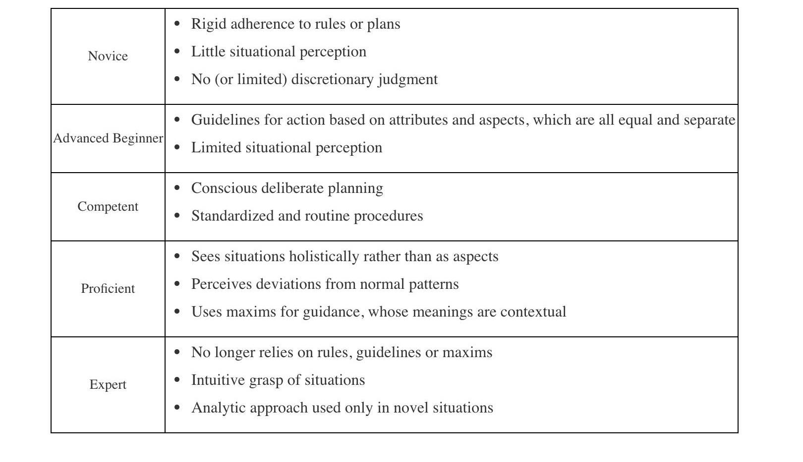

# Ścieżka - Work-in-progress

## Bardziej technicznie

1. Przeczytać - [Pragmatic Programmer](https://www.amazon.pl/Pragmatic-Programmer-journey-mastery-Anniversary/dp/0135957052).

2. Przeczytać - [GoF](https://www.digitalocean.com/community/tutorials/gangs-of-four-gof-design-patterns).

3. Tracer-bullet approach;

4. Dwa ważne koncepty, aby lepiej strukturyzować kod, część [SOLID](https://en.wikipedia.org/wiki/SOLID):

   1. [Dependency Injection / InversionOfControl](https://wiki.c2.com/?DependencyInjection)
   2. ~Single Responsibility Principle

   Z czym walczymy - rigid + complexity.

## Bardziej relacje

- Co Ciebie motywuje?
- ...

## Różnica między początkującym, zaawansowanym a ekspertem

Trzeba przejść ścieżkę, pytanie jest jak długo nam to zajmie:

- https://www.kitchensoap.com/2012/10/25/on-being-a-senior-engineer
- https://monicalent.com/blog/2019/06/03/absolute-truths-unlearned-as-junior-developer/
- https://www.edbatista.com/2015/02/conscious-competence-in-practice.html
- https://www.edbatista.com/2011/09/experiential-learning.html

## Pytanie o wskazówki bez wysłuchania i przetrawienia

Nie zależnie od etapu kariery. Często więc musimy sami popełnić błędy lub czegoś doświadczyć, aby w pełni zrozumieć czy się nauczyć.

## Facilitate growth:

- [yes, and...,](https://en.wikipedia.org/wiki/Yes,_and...);
- masterclass niezaleźnie lub w ramach z jakiejś z org ([manual prowadzenia spotkań](https://eonyc.org/wp-content/uploads/EOResources/ModeratorResources/MyEOForumModeratorGuidebook.pdf).);
- dobry start w mniejszej grupie - [Ed Batista - the art of self coaching](https://www.edbatista.com/the-art-of-self-coaching-public-course.html).

## Misc

- https://dave.cheney.net/2016/08/20/solid-go-design
