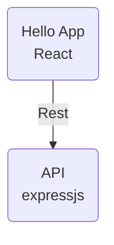

# Frontend with React

## React Podstawy

1. Zapoznaj się z przykładem [react](react/), zauważ, że można korzystać z reakta i eksperymentować z poziomu strony internetowej;

2. Przejdź przez tutorial 1 dostępny na [react.dev](https://react.dev/learn), bez hooków.

## React App 1

Ćwiczenie jest w oparciu o getting-started-with-react tutorial na [developer.mozilla.org](https://developer.mozilla.org/en-US/docs/Learn/Tools_and_testing/Client-side_JavaScript_frameworks/React_getting_started).

1. Utwórz repozytorium na githubie - `pai_4_react`:

   ```bash
   # tak jak zawsze zaczynamy
   # prace w tym samym katalogu
   cd ~/workspace
   git clone https://... /pai_4_react.git
   ```

2. Skorzystajmy z generatora, dla utworzenia aplikacji react:

   ```bash
   npx create-react-app .
   ```

3. Przejrzyjmy się wygenerowanej strukturze plików wraz z prowadzącym zajęcia.

4. Teraz przejdźmy przez strukturę następujących plików:

   ```mermaid
   flowchart LR
    App(src/App.js) --> Ijs(src/index.js) --> Ihtml(public/index.html)
   ```

   - `src/App.js` - App component;
   - `src/index.js` - index.

5. Przygotuj swoje środowisko do pracy:

   1. code z terminalem ([doc](https://code.visualstudio.com/docs/terminal/basics));
   2. W terminalu uruchom aplikacje: `npm start`;
   3. Przeglądarkę na `localhost:3000`.

6. W `src/App.js` usuń wszystko poniżej elementu `img` w obrębie `header`. Dodaj paragraph z tekstem <i>Hello, Natalio!</i>.

   ```jsx
   function App() {
      const subject = "React";
      return (
        <div className="App">
           <header className="App-header">
           
          <p>Hello, Natalio!</p>
        </header>
       </div>
     );
   }
   ```

### Zmienne (Variables) w JSX

7. Teraz skorzystajmy ze zmiennej do zdefiniowania kogo będziemy witać:

   ```jsx
   function App() {
      const subject = "Natalia";
      return (
        <div className="App">
           <header className="App-header">
           
          <p>Hello, {subject}!</p>
        </header>
       </div>
     );
   }
   ```

### Components Props

Zobaczmy teraz jak możemy wykorzystać props komponentów.

8. Będziemy chcieli teraz zdefiniować imię z poziomu `src/index.js`:

   ```jsx
   root.render(<App subject="Karolina" />);
   ```
9. Zanim coś zmienimy, zobaczmy co nas komponent dostaje od komponentu nadrzędnego:

   ```jsx
   function App(props) {
      // dodaj logowanie:
      console.log(props);
      return (
         // return statement
      );
   }
   ```

   Po zapisaniu, przeładuje się przeglądarka.

10. Otwórz *Web Developer Tools* -> *Console*, aby zobaczyć jak wygląda obiekt `props`.

11. Ostatnim krokiem jest wykorzystanie props w wyświetlanym powitaniu:

    ```jsx
    function App(props) {
      const subject = props.subject;
      return (
      // return statement
      );
    }
    ```

12. Po upewnieniu się, że wszystko działa, umieść aplikację na githubie.

## React App 2

W domu, zrób drugą część tutorialu: [aplikacja TODO](https://developer.mozilla.org/en-US/docs/Learn/Tools_and_testing/Client-side_JavaScript_frameworks/React_todo_list_beginning).

## React + Tailwind + Express

Teraz zobaczymy jak utworzyć aplikację łączącą zarówno frontend i backend.



1. Utwórz repozytorium `pai_4_app` na githubie, będziemy tam umieszczać naszą aplikację:

   ```bash

   # wroc do katalogu domowego
   cd

   # workspace
   cd workspace

   # clone!
   git clone https://... /pai_4_app.git
   cd pai_4_app
   ```

2. Zanim przejdziemy dalej, omówmy jak będzie wyglądało nasze repozytorium:

   ```
   |- client/
   |   \- ... # react app
   \- server/
       \- ... # express app
   ```

3. Wygenerujmy kod dla react app:

   ```bash
   npx create-react-app client

   # podążając za wskazówkami
   ```

   ```bash
   # sprawdzmy czy wszystko dziala
   cd client
   npm start
   ```

4. Wróćmy do głównego katalogu naszego projektu:

   ```bash
   cd ..
   ```

5. Skorzystamy z generatora do utworzenia szkieletu naszej aplikacji:

   ```bash
   npx express-generator server

   # podążając za wskazówkami
   npm install
   ```

6. Zmień funkcję `get` w routerze zdefiniowanym w `routes/index.js` na:

   ```javascript
   // ... powyżej będą importy
   router.get('/api', function(req, res, next) {
     res.setHeader('Content-Type', 'application/json');
     res.status(200)

     res.json({
       'name': 'Natalia',
       'msg': 'hello!'
     });
   });

   // poniżej eksport
   ```

   Możesz również wykasować `views/index.jade`, nie będzie nam potrzebny.

7. Przetestuj czy działa:

   ```bash
   PORT=3001 npm start
   ```

   ```bash
   curl '127.0.0.1:3001/api'

    # wynik
    {"name": "Natalia"... }
   ```

8. Teraz naszym zadaniem, będzie zaimplementowanie komunikacji między aplikacją reacta, a serwerem.

9. Aby każdy z requestów z frontendu szedł do naszego backendu:

    ```json
    // client/package.json

    "proxy": "http://localhost:3001",
    ```

10. Wystartujmy kod clienta w osobnej zakładce w terminalu:


    ```bash
    cd ../client
    npm start
    ```

11. Pobierzmy wiadomość hello world z backendu:

    ```js
    import React, { useState, useEffect } from 'react';
    import logo from './logo.svg';
    import './App.css';
 
    function App() {
      const [data, setData] = useState(null);
 
      useEffect(() => {
        fetch("/api")
          .then((res) => res.json())
          .then((data) => setData(data.msg));
      }, []);
 
      return (
        <div className="App">
          <header className="App-header">
            
            <p>{data}</p>
          </header>
        </div>
      );
    }
    export default App;
    ```
   <!-- https://www.freecodecamp.org/news/how-to-create-a-react-app-with-a-node-backend-the-complete-guide/ -->

12. Dodaj [Tailwindcss](https://tailwindcss.com/docs/guides/create-react-app) do klienta.

## Następne kroki

- Javascript -> Typescript: ([express & TS](https://blog.logrocket.com/how-to-set-up-node-typescript-express/));
- [VITE](https://vitejs.dev).
