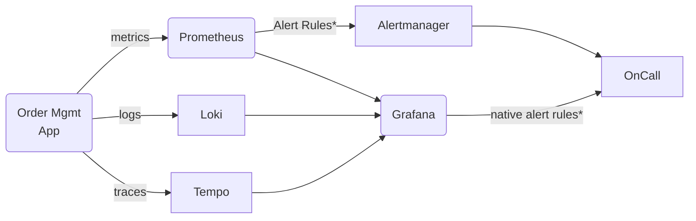

# Observability in Action

Poniższy przykład jest dla pokazania jak wygląda konfiguracje monitoringu, logingu i tracingu dla aplikacji.

Skupimy się na samej aplikacji i warstwie wizualizacyjnej w Grafanie.

Jeśli jesteś ciekaw jak skonfigurowane jest każde z tych narzędzie, możesz użyć tego przykładu dla własnych eksperymentów lub dla zadań dodatkowych podpowiedzianych przez prowadzącego.

## Prometheus / Grafana stack



Zauważ jest wiele innych implementacji technologii observability zarówno Opensource (e.g., [zipkin](https://zipkin.io) dla traisingu) jak i o zamkniętym kodzie źródłowym jak [Datadog](https://www.datadoghq.com) czy [Lightstep](https://lightstep.com).


Zauważ również, że narzędzia idą w kierunku łączenia, każdego z aspektów observability w jedno narzędzie, szczególnie logowanie i tracing.

### Monitoring:

- Metrics: Prometheus
- Vizualization and reporting: Grafana
- Alerting: Alertmanager or native Grafana

### Logging

- Loki
- Viz: Grafana

### Traces

- Tempo

## Uruchominie przykładu (WIP)

```bash
docker-compose up
```
